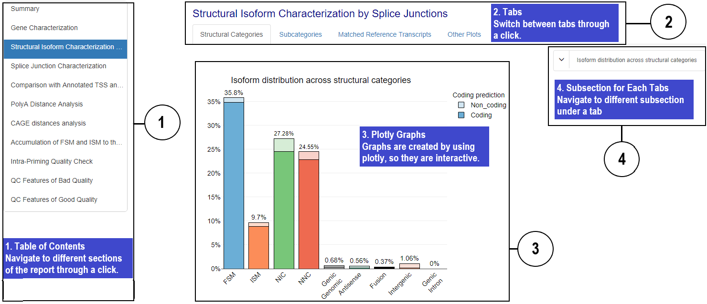

<!--
The code contains several parts:
  0.Summary
  1.Gene Characterization
  2.Structural Isoform Characterization by Splice Junctions
  3.Splice Junction Characterization
  4.Comparison with Annotated TSS and TTS
  5.Comparison With Annotated TSS and TTS by Subcategories

  6.CAGE distances analysis
  7.Redundancy Analysis
  8.Intra−Priming Quality Check
  9.QC Features of Bad Qualities
-->

<!---Basic setting-->

```{r setup, include=FALSE}
library(DT)
library(plyr)
library(plotly)
knitr::opts_chunk$set(echo = TRUE, cache = FALSE, warning = FALSE)
#### Data preparation (change previous table format)

### Summary

# Table 1: Number of isoforms in each structural category
table1MD <- as.data.frame(table(data.class$structural_category))
rownames(table1MD) <- NULL
colnames(table1MD) <- c("Category","# Isoforms")

# Table 2: Number of Novel vs Known Genes
table2MD = as.data.frame(table(isoPerGene$novelGene))
rownames(table2MD) = NULL
colnames(table2MD) = c("Category","# Genes")

# Table 3: Junction Classification
freqCat <- as.data.frame(table(uniqJunc$SJ_type))
freqCat$Var1 <- gsub(" ", "", freqCat$Var1)
freqCat$Var1 <- gsub("\n", " ", freqCat$Var1)
uniq_sj_count <- nrow(uniqJunc)
freqCat$Frac <- round(freqCat$Freq*100 / uniq_sj_count, 2)

table3MD <- as.data.frame(table(uniqJunc$SJ_type))
table3MD$Var1 <- gsub(" ", "", freqCat$Var1)
table3MD$Var1 <- gsub("\n", " ", freqCat$Var1)
table3MD$Frac <- round(freqCat$Freq*100 / uniq_sj_count, 2)
colnames(table3MD) <- c("Category","# SJs","Percent")
rownames(table3MD) <- NULL


### Comparison with Annotated TSS and TTS

# Table: Number of PolyA Motifs Detected
if (exists("df.polyA")) {
    df.polyA_MD <- df.polyA
    rownames(df.polyA_MD) <- NULL
    colnames(df.polyA_MD) <- c("Category","Count","polyA\nDetected","%")
}


# Table: Frequency of polyA motifs
if (exists("df.polyA_freq")) {
  df.polyA_freq_MD <- df.polyA_freq
  rownames(df.polyA_freq_MD) <- NULL
  colnames(df.polyA_freq_MD) <- c("Motif", "Count", "%")
}

if (exists("df.polyA_subcat")) {
  df.polyA_subcat_MD <- df.polyA_subcat
  rownames(df.polyA_subcat_MD) <- NULL
  colnames(df.polyA_subcat_MD) <- c("Category","Count","polyA\nDetected","%")
}

if (exists("df.cage")) {
  df.cage_MD <- df.cage
  rownames(df.cage_MD) <- NULL
  colnames(df.cage_MD) <- c("Category","Count","CAGE\nDetected","%")
}
if (exists("df.cage_subc")) {
  df.cage_subc_MD <- df.cage_subc
  rownames(df.cage_subc_MD) <- NULL
  colnames(df.cage_subc_MD) <- c("Subcategory","Count","CAGE\nDetected","%")
}

#### Condition check (check whether show plots or not)

### Gene Characterization
multiple_samples <- length(FL_multisample_indices)>0
iso_expression_provided <- !all(is.na(data.class$iso_exp))
FL_expression_provided <- !all(is.na(data.class$FL))

### Structural Isoform Characterization by Splice Junctions
ISM_FSM_transcript <- nrow(data.FSMISM) > 0
gene_expression_provided<- !all(is.na(data.class$gene_exp))
NNC_provided<- nrow(data.class[data.class$structural_category=="NNC",])!=0

### Splice Junction Characterization
junction_provided <- nrow(data.junction) > 0
RTS_junction_provided <- sum(data.junction$RTS_junction=='TRUE') > 0

### Comparison with Annotated TSS and TTS
FSM_provided <- nrow(data.FSM) > 0
ISM_provided <- nrow(data.ISM) > 0
polyA_dist_provided <- sum(!is.na(data.class$polyA_dist)) > 10


### CAGE distances analysis
dist_to_cage_peak_provided<- !all(is.na(data.class$dist_to_cage_peak))
polyA_motif_provided <- !all(is.na(data.class$polyA_motif))


### Good Quality Controls
predicted_NMD_n_t <-  n_t3.SJ>0 & n_t3.RTS>0 &!all(is.na(data.class$predicted_NMD))


## Figures
### P1

p1x <- levels(p1$data$structural_category) # x axis
p1x_order <- 1:length(p1x)
p1x_row <- c(paste0(p1x, ' ','coding'), (paste0(p1x, ' ','non_coding')))

p1y1 <- c() # coding
p1y2 <- c() # non_coding

p1x_df <-  as.data.frame(rep(0, length(p1x_row)))
rownames(p1x_df) <-  p1x_row

p1_summary <- as.data.frame(summary(as.factor(paste0(p1$data$structural_category, ' ', p1$data$coding))))
for (i in rownames(p1x_df)) {
  if (i %in% rownames(p1_summary)) {
    p1x_df$`rep(0, length(p1x_row))`[rownames(p1x_df) == i] = p1_summary$`summary(as.factor(paste0(p1$data$structural_category, " ", p1$data$coding)))`[rownames(p1_summary) == i]
  }
}

index_1 = 1
index_2 = 1
for (i in p1x) {
  for (j in rownames(p1x_df)) {
    if (i == strsplit(j, ' ')[[1]][1]) {
      if (strsplit(j, ' ')[[1]][2] == 'coding') {
        p1y1[index_1] <- p1x_df[j,]
        index_1 = index_1 + 1
      } else {
        p1y2[index_2] <- p1x_df[j,]
        index_2 = index_2 + 1
      }
    }
  }
}

p1y1_plot = p1y1/sum(p1y1+p1y2)
p1y2_plot = p1y2/sum(p1y1+p1y2)
p1y_sum = round(p1y1_plot + p1y2_plot, 4)
nGenes = nrow(isoPerGene)
nIso = nrow(data.class)

myPalette_fade <- c("#D2E6F2", "#FEDCCD", "#D6EDD6", "#F9D2CA", "#DFDFDF", "#D1ECE3", "#FFECBD", "#F8DFD7", "#C6E9ED", "#F0CAC3", "#FEE0BE")
```

<body>
  <a class="show-modal" href="#">
    <i class="fas fa-question-circle"></i> How to use the report?
  </a>
  
  <div class="overlay hidden"><button class="close-modal">&times;</button><p class="header">How to read the report?</p><p>The report contains several parts, please see the following plot to get more detail about the report</p></div>
</body>

<!--
Summary
  1.Gene classification
  2.Characterization of transcripts
  3.Splice Junction Classification
-->

## Summary {.tabset .tabset-fade}

<p> ***Unique Genes: `r nGenes`*** <br> ***Unique Isoforms: `r nIso`*** </p>

### Gene classification

```{r, echo=FALSE}
datatable(
  table2MD,
  options = list(dom = 't'),
  caption = htmltools::tags$caption(
    style = 'caption-side: bottom; text-align: center;','Table 1: ',
    htmltools::em('Gene classification.'))
  )
```

### Characterization of transcripts based on splice junctions

```{r, echo=FALSE}
datatable(
  table1MD,
  options = list(dom = 't'),
  caption = htmltools::tags$caption(
    style = 'caption-side: bottom; text-align: center;','Table 2: ',
    htmltools::em('Characterization of transcripts based on splice junctions'))
)
```

### Splice Junction Classification

```{r, echo=FALSE}
datatable(table3MD,
          options = list(dom = 't'),
          caption = htmltools::tags$caption(
            style = 'caption-side: bottom; text-align: center;','Table 3: ',
            htmltools::em('Splice Junction Classification'))
)
```

<!--
Gene Characterization
  1. Number of Isoforms per Gene
  2. Transcript Length
  3. Other Plots
-->

## Gene Characterization {.tabset .tabset-fade }

<!--1-->

### Number of Isoforms per Gene {.tabset .tabset-fade .tabset-dropdown}

#### Isoforms Number x-Axis

```{r p0,  echo=FALSE}
ggplotly(p0)%>%
  layout(margin = list(r = 150), showlegend = F)
```

#### Kown vs Novel Genes

```{r p7, echo=FALSE}
ggplotly(p7)%>%
  layout(margin = list(r = 150))
```

<!--2-->

### Transcript Length {.tabset .tabset-fade .tabset-dropdown}

#### Classification

```{r p.classByLen.a, echo=FALSE}
ggplotly(p.classByLen.a)%>%
  layout(margin = list(r = 150))
```

#### Normalized Classification

```{r p.classByLen.b, echo=FALSE}
ggplotly(p.classByLen.b)%>%
  layout(margin = list(r = 150))
```

#### All Transcripts

```{r p.length.all, echo=FALSE}
ggplotly(p.length.all)%>%
  layout(margin = list(r = 130))
```

#### By Structural Category

```{r p.length.cat, echo=FALSE}
ggplotly(p.length.cat)%>%
  layout(margin = list(r = 150))
```

#### Mono- vs Multi-Exons

```{r p.length.exon, echo=FALSE}
ggplotly(p.length.exon)%>%
  layout(margin = list(r = 130))
```

<!-- codes only run when multiple_samples is true -->

```{r p.length.all.sample, echo=FALSE, eval = exists("p.length.all.sample"), results ='asis'}
cat('\n####'," By Sample", '\n')
ggplotly(p.length.all.sample)%>%
  layout(margin = list(r = 130))
cat('\n')
```

```{r p.length.exon.sample, echo=TRUE, eval = exists("p.length.exon.sample"), results ='asis'}
cat ('\n####'," Mono- vs Multi-Exons, By Sample", '\n')
ggplotly(p.length.exon.sample)%>%
  layout(margin = list(r = 130))
cat ('\n')
```

<!--3-->

### Exon Structure

```{r p6, echo=FALSE}
ggplotly(p6)%>%
  layout(margin = list(r = 130))
```

<!--4-->

```{r, echo=FALSE, eval = exists("p10") || exists("p11"), results ='asis'}
cat ('\n###',"Quantification {.tabset .tabset-fade .tabset-dropdown}", '\n')
```

<!-- codes only run when expresion provided -->

```{r p10, echo=FALSE, eval = exists("p10"), results ='asis'}
cat ('\n####',"Gene Expression, Annotated vs Novel", '\n')
ggplotly(p10)%>%
  layout(margin = list(r = 130), showlegend = F)
cat ('\n')
```

<!-- codes only run when FL count provided -->

```{r p11, echo=FALSE, eval = exists("p11"), results ='asis'}
cat ('\n####',"Number of FL reads per Gene by type of gene annotation", '\n')
ggplotly(p11)%>%
  layout(margin = list(r = 130), showlegend = F)
cat ('\n')
```

<!--
Structural Isoform Characterization 
  1.Structural Categories
  2.Subcategories
  3.Matched Reference Transcripts
  4.Other Plots
-->

## Structural Isoform Characterization {.tabset .tabset-fade }

<!-- 1 -->

### Isoform Distribution {.tabset .tabset-fade .tabset-dropdown}

#### Across Structural Categories

```{r p1, echo=FALSE}
plot_ly(x=reorder(p1x, p1x_order), y=p1y1_plot, type='bar', name = "Coding", text = paste0(p1y_sum*100,"%"), textposition = 'none',
        marker = list(color= myPalette,
                      line = list(color = '#000000', width = 1))) %>%
  add_trace(y = p1y2_plot, name = "Non_coding", marker= list(color=myPalette_fade),textposition= 'outside') %>%

  layout(title = list(text = "Isoform distribution across structural categories", font= list (size = 18), x = 0.4),
         font = list(family = "arial", color = "#000000", size = 14),
         barmode='stack',
         yaxis = list(tickformat='%'),
         xaxis = list(tickangle = -45),
         legend = list(title = list(text = 'Coding prediction')))

```

```{r p1.s.list, echo=FALSE, eval = length(p1.s.list), results ='asis'}
p1.s.titles = list("\n####Across FSM\n",
                   "\n####Across ISM\n",
                   "\n####Across NNC\n",
                   "\n####Across NIC\n",
                   "\n####Across Genic Genomic\n",
                   "\n####Across Antisense\n",
                   "\n####Across Fusion\n",
                   "\n####Across Intergenic\n",
                   "\n####Across Genic Intron\n")
for (i in 1:length(p1.s.list)) {
  cat(p1.s.titles[[i]])
  ggplotly(p1.s.list[[i]])%>%
    layout(margin = list(r = 130), showlegend = F)
}

```

### Transcript Lengths {.tabset .tabset-fade .tabset-dropdown}

#### By Structural Classification

```{r p4, echo=FALSE}
ggplotly(p4) %>%
  layout(showlegend = F)
```

#### By Subcategory

```{r p4.s1_p4.s2, echo=FALSE}
ggplotly(p4.s1) %>%
  layout(showlegend = F)

ggplotly(p4.s2) %>%
  layout(showlegend = F)
```


### Exon Counts by Structural Classification {.tabset .tabset-fade .tabset-dropdown}

#### By Structural Classification 

```{r p5, echo=FALSE}
ggplotly(p5) %>%
  layout(showlegend = F)
```

#### By Subcategory

```{r p5.s1_p5.s2, echo=FALSE}
ggplotly(p5.s1) %>%
  layout(showlegend = F)

ggplotly(p5.s2) %>%
  layout(showlegend = F)
```

```{r, echo=FALSE, eval = exists("p2") || exists("p3"), results ='asis'}
cat ('\n###',"Matched Reference Transcripts {.tabset .tabset-fade .tabset-dropdown}", '\n')
```

<!-- codes only run when expresion provided -->

```{r p2, echo=FALSE, eval = exists("p2"), results ='asis'}
cat ('\n####',"Length Distribution", '\n')
ggplotly(p2)%>%
  layout(margin = list(r = 130), showlegend = F)
cat ('\n')
```

<!-- codes only run when FL count provided -->

```{r p3, echo=FALSE, eval = exists("p3"), results ='asis'}
cat ('\n####',"Exon Count Distribution", '\n')
ggplotly(p3)%>%
  layout(margin = list(r = 130), showlegend = F)
cat ('\n')
```


<!--
Splice Junction Characterization
  1. Distribution
  2. RT-switching
-->

<!-- 1 -->

```{r p23.a_p23.b_p29.a_p29.b, echo=FALSE, eval = exists("p23.a") || exists("p23.b") || exists("p29.a") || exists("p29.b"), results ='asis'}
cat ('\n##'," Splice Junction Characterization {.tabset .tabset-fade }", '\n')
```

```{r p23.a_p23.b, echo=FALSE, eval = exists("p23.a") || exists("p23.b"), results ='asis'}
cat ('\n###', "Distribution {.tabset .tabset-fade .tabset-dropdown}", '\n')
cat ('\n####', "Distribution of Splice Junctions by Structural Classification", '\n')
ggplotly(p23.a)
cat ('\n')
cat('\n####', "Distribution of Transcripts by Splice Junctions", '\n')
ggplotly(p23.b)
cat ('\n')
```

```{r p29.a_p29.b, echo=FALSE, eval = exists("p29.a") || exists("p29.b"), results ='asis'}
cat ('\n###', "RT−Switching {.tabset .tabset-fade .tabset-dropdown}", '\n')
cat ('\n####', "RT−Switching All Junctions", '\n')
ggplotly(p29.a)
cat ('\n')
cat('\n####', "Unique Junctions RT−switching", '\n')
ggplotly(p29.b)
cat ('\n')
```


```{r , echo=FALSE, eval = nrow(data.FSM) > 0, results ='asis'}
cat ('\n##'," Comparison With Annotated TSS and TTS {.tabset .tabset-fade }", '\n')
```

```{r p21.a_p21.b_p21.dist3.ISM.a_p21.dist3.ISM.b, echo=FALSE, eval = exists("p21.a") || exists("p21.b") || exists("p21.dist3.ISM.a") || exists ("p21.dist3.ISM.b") || exists ("p21.FSM.list.a") || exists ("p21.ISM.list.a") , results ='asis'}
cat ('\n###', "Distance to Annotated Polyadenylation Site {.tabset .tabset-fade .tabset-dropdown}", '\n')
```

```{r p21.FSM.list, echo=FALSE, eval = exists("p21.FSM.list"), results ='asis'}
p21.stitles.FSM<-list("Alternative 3'End for FSM",
                      "Alternative 3'5'End for FSM",
                      "Alternative 5'End for FSM",
                      "Reference Match for FSM")
for (i in 1:length(p21.FSM.list)) {
  cat ('\n####', p21.stitles.FSM[i], '\n')
  print(p21.FSM.list[i])
  print(p21.FSM.list.a[i])
}
```

```{r p21.ISM.list, echo=FALSE, eval = exists("p21.ISM.list"), results ='asis'}
if (length(p21.ISM.list)) {
  p21.stitles.ISM<-list("Alternative 3'End for ISM",
                      "Alternative 3'5'End for ISM",
                      "Alternative 5'End for ISM",
                      "Reference Match for ISM")
cat ('\n###', "Distance to Annotated Polyadenylation Site {.tabset .tabset-fade .tabset-dropdown}", '\n')
for (i in 1:length(p21.ISM.list)) {
  cat ('\n####', p21.stitles.ISM[i], '\n')
  ggplotly(p21.ISM.list[i])
  ggplotly(p21.ISM.list.a[i])
}
}

```


```{r p21.a_p21.b, echo=FALSE, eval = exists("p21.a") || exists("p21.b"), results ='asis'}
cat ('\n####', "For FSM", '\n')
ggplotly(p21.a)
cat('\n')
ggplotly(p21.b)
cat('\n')
```

```{r p21.dist3.ISM.a_p21.dist3.ISM.b, echo=FALSE, eval = exists("p21.dist3.ISM.a") || exists("p21.dist3.ISM.b"), results ='asis'}
cat ('\n####', "For ISM", '\n')
ggplotly(p21.dist3.ISM.a)
cat('\n')
ggplotly(p21.dist3.ISM.b)
cat('\n')
```

```{r p22.a_p22.b_p22.dist3.ISM.a_p22.dist3.ISM.b, echo=FALSE, eval = exists("p22.a") || exists("p22.b") || exists("p22.dist5.ISM.a") || exists ("p22.dist5.ISM.b") || exists ("p22.FSM.list.a") || exists ("p22.ISM.list.a") , results ='asis'}
cat ('\n###', "Distance to Annotated Polyadenylation Site {.tabset .tabset-fade .tabset-dropdown}", '\n')
```

```{r p22.FSM.list, echo=FALSE, eval = exists("p22.FSM.list"), results ='asis'}
p22.stitles.FSM<-list("Alternative 3'End for FSM",
                      "Alternative 3'5'End for FSM",
                      "Alternative 5'End for FSM",
                      "Reference Match for FSM")
for (i in 1:length(p22.FSM.list)) {
  cat ('\n####', p22.stitles.FSM[i], '\n')
  print(p22.FSM.list[i])
  print(p22.FSM.list.a[i])
}
```

```{r p22.ISM.list, echo=FALSE, eval = exists("p22.ISM.list"), results ='asis'}
if (length(p22.ISM.list)) {
p22.stitles.ISM<-list("Alternative 3'End for ISM",
                      "Alternative 3'5'End for ISM",
                      "Alternative 5'End for ISM",
                      "Reference Match for ISM")
for (i in 1:length(p22.ISM.list)) {
  cat ('\n####', p22.stitles.ISM[i], '\n')
  print(p22.ISM.list[i])
  print(p22.ISM.list.a[i])
}
}
```

```{r p22.a_p22.b, echo=FALSE, eval = exists("p22.a") || exists("p22.b"), results ='asis'}
cat ('\n####', "For FSM", '\n')

ggplotly(p22.a)
cat('\n')

ggplotly(p22.b)
cat('\n')
```

```{r p22.dist3.ISM.a_p22.dist3.ISM.b, echo=FALSE, eval = exists("p22.dist5.ISM.a") || exists("p22.dist5.ISM.b"), results ='asis'}
cat ('\n####', "For ISM", '\n')

ggplotly(p22.dist5.ISM.a)
cat('\n')

ggplotly(p22.dist5.ISM.b)
cat('\n')
```

<!--
PolyA Distance Analysis
-->

```{r , echo=FALSE, eval = exists("p.polyA_dist") || exists("p.polyA_dist_subcat"), results ='asis', warning=FALSE}
cat ("## PolyA Distance Analysis {.tabset .tabset-fade }", '\n')
```

<!-- 1 -->

```{r , echo=FALSE, eval = exists("p.polyA_dist"), results ='asis', warning=FALSE}
cat ('\n###'," PolyA Distance Analysis by categories", '\n')
ggplotly(p.polyA_dist)%>%
  layout(margin = list(r = 130))
cat ('\n')

datatable(df.polyA_MD,
          options = list(dom = 't'),
          caption = htmltools::tags$caption(
            style = 'caption-side: bottom; text-align: center;',
            htmltools::em('Number of PolyA Motifs Detected'))
)

datatable(df.polyA_freq,
          options = list(dom = 't'),
          caption = htmltools::tags$caption(
            style = 'caption-side: bottom; text-align: center;',
            htmltools::em('Frequency of PolyA Motifs'))
)
```


```{r p.polyA_dist_sub, echo=FALSE, eval = exists("p.polyA_dist_subcat"), results ='asis', warning=FALSE}
cat ('\n###',"PolyA Distance Analysis by subcategories", '\n')
ggplotly(p.polyA_dist_subcat)%>%
  layout(margin = list(r = 130))
cat ('\n')

ggplotly(p.polyA_dist_subcat.other)

datatable(df.polyA_subcat_MD,
          options = list(dom = 't'),
          caption = htmltools::tags$caption(
            style = 'caption-side: bottom; text-align: center;',
            htmltools::em('Number of PolyA Motifs Detected'))
)

datatable(df.polyA_freq,
          options = list(dom = 't'),
          caption = htmltools::tags$caption(
            style = 'caption-side: bottom; text-align: center;',
            htmltools::em('Frequency of PolyA Motifs'))
)
```


<!--
CAGE distances analysis
  1.Multi-exonic FSM
  2.Multi-exonic ISM
  3.Multi-exonic NIC/NCC
-->

```{r , echo = FALSE, eval = !all(is.na(data.class$dist_to_cage_peak)), results ='asis', warning = FALSE}
cat ('\n##'," CAGE distances analysis {.tabset .tabset-fade }", '\n')
```

```{r , echo = FALSE, eval = exists("cage_hist_FSM") || exists ("cage_hist_FSM_perc"), results ='asis', warning = FALSE}
cat ('\n###'," Multi-exonic FSM {.tabset .tabset-fade .tabset-dropdown}", '\n')
```

```{r , echo = FALSE, eval = exists("cage_hist_FSM") || exists ("cage_hist_FSM_perc"), results ='asis', warning = FALSE}
cat ('\n####', "Distance to CAGE peak of multi-exonic FSM", '\n')
ggplotly(cage_hist_FSM,cliponaxis = FALSE) %>%
    layout(margin = list(r = 130))
ggplotly(cage_hist_FSM_perc,cliponaxis = FALSE) %>%
    layout(margin = list(r = 130))

if (exists("cage.FSM.list")) {
    if (length(cage.FSM.list)>0) {
    for (i in 1:length(cage.FSM.list)){
      print(cage.FSM.list[i])
      print(cage.FSM.list.a[i])
    }
  }
}

cat ('\n')
```

```{r , echo = FALSE, eval = exists("cage_hist_ISM") , results ='asis', warning = FALSE}
cat ('\n###'," Multi-exonic ISM {.tabset .tabset-fade .tabset-dropdown}", '\n')
```

```{r , echo = FALSE, eval = exists("cage_hist_ISM"), results ='asis', warning = FALSE}
cat ('\n####', "Distance to CAGE peak of multi-exonic ISM", '\n')
ggplotly(cage_hist_ISM) %>%
    layout(margin = list(r = 130))
ggplotly(cage_hist_ISM_perc) %>%
    layout(margin = list(r = 130))

if (exists("cage.ISM.list")) {
    if (length(cage.ISM.list)>0) {
    for (i in 1:length(cage.ISM.list)){
      print(cage.ISM.list[i])
      print(cage.ISM.list.a[i])
    }
  }
}
cat ('\n')
```


```{r , echo = FALSE, eval = exists("cage_hist_NIC") || exists("cage_hist_NNC"), results ='asis', warning = FALSE}
cat ('\n###'," Multi-exonic NIC/NNC {.tabset .tabset-fade .tabset-dropdown}", '\n')
```

```{r , echo = FALSE, eval = exists("cage_hist_NIC"), results ='asis', warning = FALSE}
cat ('\n####', "Distance to CAGE peak of multi-exonic NIC", '\n')
ggplotly(cage_hist_NIC) %>%
    layout(margin = list(r = 130))
ggplotly(cage_hist_NIC_perc)%>%
    layout(margin = list(r = 130))

if (exists("cage_hist_NIC")) {
    if (length(cage.NIC.list)>0) {
    for (i in 1:length(cage.NIC.list)){
      print(cage.NIC.list[i])
      print(cage.NIC.list.a[i])
    }
  }
}

cat ('\n')
```

```{r , echo = FALSE, eval = exists("cage_hist_NNC"), results ='asis', warning = FALSE}
cat ('\n####', "Distance to CAGE peak of multi-exonic NNC", '\n')
ggplotly(cage_hist_NNC) %>%
    layout(margin = list(r = 130))
ggplotly(cage_hist_NNC_perc)%>%
    layout(margin = list(r = 130))

if (exists("cage_hist_NNC")) {
    if (length(cage.NNC.list)>0) {
    for (i in 1:length(cage.NNC.list)){
      print(cage.NNC.list[i])
      print(cage.NNC.list.a[i])
    }
  }
}
cat ('\n')

```


```{r , echo = FALSE, eval = exists("df.cage_MD") || exists("df.cage_subc_MD"), results ='asis', warning = FALSE}
cat ('\n###',"CAGE Detected(Number) {.tabset .tabset-fade .tabset-dropdown}", '\n')
datatable(df.cage_MD,
          options = list(dom = 't'),
          caption = htmltools::tags$caption(
            style = 'caption-side: bottom; text-align: center;',
            htmltools::em('Number of CAGE Detected'))
)

datatable(df.cage_subc_MD,
          options = list(dom = 't'),
          caption = htmltools::tags$caption(
            style = 'caption-side: bottom; text-align: center;',
            htmltools::em('Number of CAGE Detected'))
)

```


<!--
Redundancy Analysis
  1. Only FSM
  2. Only ISM
  3. FSM+ISM
-->

```{r FSM_provided_ISM_provided, echo = FALSE, eval = nrow(data.ISM) > 0 || nrow(data.FSM) > 0, results ='asis', warning = FALSE}
cat ('\n##'," Redundancy Analysis {.tabset .tabset-fade }", '\n')
```

<!-- 1 -->

```{r FSM_provided, echo = FALSE, eval = FSM_provided, results ='asis', warning = FALSE}
cat ('\n###'," Only FSM {.tabset .tabset-fade .tabset-dropdown}", '\n')
cat ('\n####', "Only FSM", '\n')
ggplotly(new.1.FSM) %>%
  layout(margin = list(r = 130)) %>%
  style(textposition = 'top center')
cat ('\n')
```

```{r FSM_provided_peak, echo = FALSE, eval = FSM_provided && dist_to_cage_peak_provided, results ='asis', warning = FALSE}
cat ('\n####', "Only FSM with CAGE support", '\n')
ggplotly(new.2.FSM) %>%
  layout(margin = list(r = 130)) %>%
  style(textposition = 'top center')
cat ('\n')
```

```{r FSM_provided_polyA, echo = FALSE, eval = FSM_provided && polyA_motif_provided, results ='asis', warning = FALSE}
cat ('\n####', "Only FSM with polyA motif found", '\n')
ggplotly(new.3.FSM) %>%
  layout(margin = list(r = 130))  %>%
  style(textposition = 'top center')
cat ('\n')
```

```{r FSM_provided_polyA_peak, echo = FALSE, eval = FSM_provided && polyA_motif_provided && dist_to_cage_peak_provided, results ='asis', warning = FALSE}
cat ('\n####', "Only FSM with CAGE support and polyA motif", '\n')
ggplotly(new.4.FSM) %>%
  layout(margin = list(r = 130)) %>%
  style(textposition = 'top center')
cat ('\n')
```

<!-- 2 -->

```{r ISM_provided, echo = FALSE, eval = ISM_provided, results ='asis', warning = FALSE}
cat ('\n###'," Only ISM {.tabset .tabset-fade .tabset-dropdown}", '\n')
cat ('\n####', "Only ISM", '\n')
ggplotly(new.1.ISM) %>%
  layout(margin = list(r = 130))  %>%
  style(textposition = 'top center')
cat ('\n')
```

```{r ISM_provided_peak, echo = FALSE, eval = ISM_provided && dist_to_cage_peak_provided, results ='asis', warning = FALSE}
cat ('\n####', "Only ISM with CAGE support", '\n')
ggplotly(new.2.ISM) %>%
  layout(margin = list(r = 130)) %>%
  style(textposition = 'top center')
cat ('\n')
```

```{r ISM_provided_polyA, echo = FALSE, eval = ISM_provided && polyA_motif_provided, results ='asis', warning = FALSE}
cat ('\n####', "Only ISM with polyA motif found", '\n')
ggplotly(new.3.ISM) %>%
  layout(margin = list(r = 130)) %>%
  style(textposition = 'top center')
cat ('\n')
```

```{r ISM_provided_polyA_peak, echo = FALSE, eval = ISM_provided && dist_to_cage_peak_provided && polyA_motif_provided, results ='asis', warning = FALSE}
cat ('\n####', "Only ISM with CAGE support and polyA motif", '\n')
ggplotly(new.4.ISM) %>%
  layout(margin = list(r = 130)) %>%
  style(textposition = 'top center')
cat ('\n')
```

<!-- 3 -->

```{r total_provided_total, echo = FALSE, eval = FSM_provided&&ISM_provided, results ='asis', warning = FALSE}
cat ('\n###',"FSM+ISM {.tabset .tabset-fade .tabset-dropdown}", '\n')
cat ('\n####', "FSM+ISM", '\n')
ggplotly(new.1.total) %>%
  layout(margin = list(r = 130)) %>%
  style(textposition = 'top center')
cat ('\n')
```

```{r total_provided_peak, echo = FALSE, eval = FSM_provided&&ISM_provided && dist_to_cage_peak_provided, results ='asis', warning = FALSE}
cat ('\n####', "FSM+ISM with CAGE support", '\n')
ggplotly(new.2.total) %>%
  layout(margin = list(r = 130)) %>%
  style(textposition = 'top center')
cat ('\n')
```

```{r total_provided_polyA, echo = FALSE, eval = FSM_provided&&ISM_provided && polyA_motif_provided, results ='asis', warning = FALSE}
cat ('\n####', "FSM+ISM with polyA motif found", '\n')
ggplotly(new.3.total) %>%
  layout(margin = list(r = 130)) %>%
  style(textposition = 'top center')
cat ('\n')
```

```{r total_provided_polyA_peak, echo = FALSE, eval = FSM_provided&&ISM_provided && polyA_motif_provided && dist_to_cage_peak_provided, results ='asis', warning = FALSE}
cat ('\n####', "FSM+ISM with CAGE support and polyA motif", '\n')
ggplotly(new.4.total) %>%
  layout(margin = list(r = 130)) %>%
  style(textposition = 'top center')
cat ('\n')
```

<!--
Intra−Priming Quality Check
  1.By Structural Category
  2.Mono- vs Multi-Exon
  3.Coding vs Non-Coding
-->

## Intra-Priming Quality Check {.tabset .tabset-fade }

<!-- 1 -->

```{r p30, echo=FALSE, results ='asis', warning = FALSE}
cat ('\n###',"By Structural Category", '\n')
ggplotly(p30)
ggplotly(p30.a)
cat ('\n')
```

<!-- 2 -->

```{r p31, echo=FALSE, results ='asis', warning = FALSE}
cat ('\n###',"Mono- vs Multi-Exon", '\n')
ggplotly(p31) %>%
  layout(boxmode = "group")  %>%
  layout(legend = list(orientation = "h", x = 0, y = -0.6)) %>%
  style(textposition = 'top center')
cat ('\n')
```

<!-- 3 -->

```{r p32, echo=FALSE, results ='asis', warning = FALSE}
cat ('\n###',"Coding vs Non-Coding", '\n')
ggplotly(p32) %>%
  layout(boxmode = "group")  %>%
  layout(legend = list(orientation = "h", x = 0, y = -0.6)) %>%
  style(textposition = 'top center')
cat ('\n')
```

```{r, echo=FALSE, results ='asis', eval=(saturation.curves=='True')&&!all(is.na(data.class$FL)),warning = FALSE}
cat ('\n##',"Saturation curves", '\n')
ggplotly(rar1[[1]])
ggplotly(rar1[[2]])
ggplotly(rar2[[1]])
ggplotly(rar2[[2]])
ggplotly(rar3[[1]])
ggplotly(rar3[[2]])
ggplotly(rar5[[1]])
ggplotly(rar5[[2]])
cat ('\n')
```


## Features of Bad Quality {.tabset .tabset-fade }

### RT-switching {.tabset .tabset-fade }

```{r , echo=FALSE, results ='asis', warning = FALSE}
ggplotly(p28.RTS)%>%
  layout(margin = list(r = 130)) %>%
  layout(showlegend = F) 
cat ('\n')
```


### Junctions {.tabset .tabset-fade .tabset-dropdown}

```{r , echo=FALSE, results ='asis', warning = FALSE}
cat("#### Non-Canonical Junctions",'\n')
ggplotly(p28.SJ)%>%
  layout(margin = list(r = 130)) 
cat ('\n')
```

```{r , echo=FALSE, results ='asis', eval= exists("p28.Cov"), warning = FALSE}
cat("#### Splice Junctions Without Short Read Coverage",'\n')
ggplotly(p28.Cov)%>%
  layout(margin = list(r = 130)) 
cat ('\n')
```

```{r , echo=FALSE, results ='asis',eval=exists("p28") || exists("p28.NMD"), warning = FALSE}
cat("### Structural Categories {.tabset .tabset-fade  .tabset-dropdown}", '\n')
```

```{r , echo=FALSE, results ='asis',eval=exists("p28"), warning = FALSE}
cat("#### Quality Control Attributes Across Structural Categories",'\n')
ggplotly(p28)%>%
  layout(margin = list(r = 130)) 
cat ('\n')
```

```{r , echo=FALSE, results ='asis',eval=exists("p28.NMD"), warning = FALSE}
cat("#### Nonsense-Mediated Decay by Structural Category",'\n')
ggplotly(p28.NMD)%>%
  layout(margin = list(r = 130)) 
cat ('\n')
```

## Features of Good Quality {.tabset .tabset-fade }

### Annotation Support {.tabset .tabset-fade .tabset-dropdown}

```{r , echo=FALSE, results ='asis', warning = FALSE}
cat("#### Annotation support", '\n') 
ggplotly(p28.a.annot)%>%
  layout(margin = list(r = 130)) 
cat ('\n')
```

```{r, echo=FALSE, results ='asis',eval=exists("p28.a.Cage"), warning = FALSE}
cat("#### Dist to cage peak", '\n') 
ggplotly(p28.a.Cage)%>%
  layout(margin = list(r = 130)) 
cat ('\n')
```

### Junctions {.tabset .tabset-fade .tabset-dropdown}

```{r , echo=FALSE, results ='asis', warning = FALSE}
cat("#### All Canonical Junctions", '\n') 
ggplotly(p28.a.SJ)%>%
  layout(margin = list(r = 130)) 
cat ('\n')
```

```{r, echo=FALSE, results ='asis',eval=exists("p28.a.polyA"), warning = FALSE}
cat("#### polyA", '\n') 
ggplotly(p28.a.polyA)%>%
  layout(margin = list(r = 130)) 
cat ('\n')
```

### Good Quality Control Attributes {.tabset .tabset-fade .tabset-dropdown}

```{r , echo=FALSE, results ='asis', warning = FALSE}
cat("#### Good Quality Control Attributes Across Structural Categories", '\n') 
ggplotly(p28)%>%
  layout(margin = list(r = 130)) 
cat ('\n')
```


<script src="http://kit.fontawesome.com/46057cf47a.js" crossorigin="anonymous"></script>
<script src="script.js"></script>

